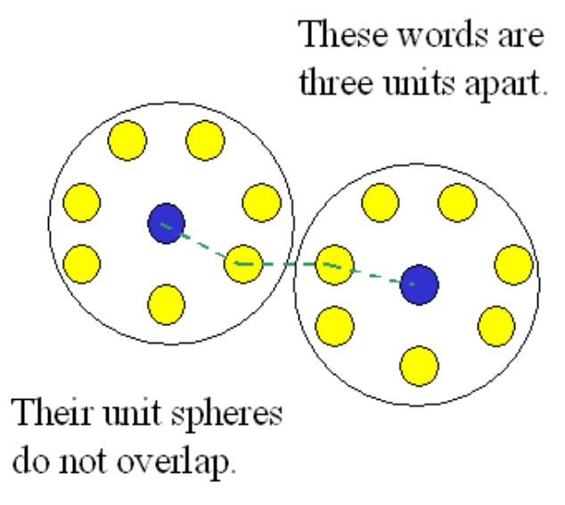

# PSA 1: Debugging, Testing, and Hamming
This PSA is due Tuesday, October 15, at 11:59 pm

## PSA1 Introduction
In this initial part of your first programming/problem solving assignment, we introduce the basics of debugging and testing. The major portion of the assignment, the programming portion, will focus on encoding and decoding. This assignment is out of 100 points with an opportunity for 5 extra credit points.

### Words of Wisdom (WOW!)
Manage your time wisely. Each part (including the README and adhering to style) may take different amounts of time. **Do not start PSAs the day before they are due, or you will have a bad time.** It is normal for PSAs to take longer than 12 hours, especially as you progress in the CSE curriculum. This is because programming skill comes with practice, just like any other skill, and we develop these assignments with your learning in mind. 

### Gradescope
Submit early and often to Gradescope. There's no harm in sending your work early, and doing so can even act as a backup. We will grade the most recent submission. There are unlimited submissions. **Your code must compile to receive credit.** Graders will not fix compiler errors. This means compiler errors will result in zeroes for relevant sections. 

## PSA 1 Information
We advise that you read all of the instructions before starting the PSA. You are responsible for knowing the content presented. This website may be viewed on mobile.

These are the components of this PA. 
1. Debugging Code
1. Styling Code
1. Introduction: Hamming Code
1. Hamming Encoding and Decoding Implementation
1. Hints
1. Summary, Submission, Style

## Starter Code
Copy the starter code using the same command as in PSA 0. The starter code is located at
```bash
~/../public/psa1
```

**FAQ and concerns**
- Why do we use 1, 2, and 4 as parity bit positions?
    - We use powers of 2 for parity (2<sup>0</sup>, 2<sup>1</sup>, 2<sup>2</sup>) so that the parity bit 2 (i.e. b'010) checks for all the bits in indices that has a 1 in the middle. You use b'010 as a "bit mask" to binary AND (`&`) with the index and see if this parity bit accounts for this data bit. This means each parity bit to cross-checks the other parity bits, allowing us to detect and correct errors.
- What happens if a parity bit is flipped?
    - Same thing as if any other bit is flipped -- the bit position will correspond to the parity bit only, and so your code should flip that faulty parity bit.
- If you are working on the "Testing hammingDecode" part:
    - Please make sure you type the right statement in your if-statements. It should be using `!(string.equals(string))` to compare Strings instead of `!=`.
- "Directory Omitted" error when trying to copy starter files causing files to not be copied over:
    - You are trying to copy the directory itself rather than the files in it. This is because you forgot a command line flag for cp. To find out what this is, refer back to the PA0 writeup.
- I want to know more about StringBuilder
    - Here is a short video about it https://www.youtube.com/watch?v=QLKf1h49T0M 

## Piazza Guidelines
You can find them here https://docs.google.com/document/d/1XtEz3If5vaNqw4Wlpt46RLdCcGUxTcZ2P6dH7DL5Kxs/edit

## Unix Commands
We'll keep introducing you to more shell commands gradually, but in case you wanted to get ahead, here's a UNIX command cheat sheet. 
**Review the commands** that you should have some familiarity with (ls, cd, cp, etc.). We know it seems like a strange language right now, but the more you practice them, the more easily you'll be able to navigate around your programming environment!
https://drive.google.com/file/d/1bwzfZwDNrC-1XuHcpuphYJgo3S5_boNH/view

## Vim Commands
Starting from this assignment, you'll have to write a lot more code than before, so you should take this opportunity to practice using vim commands. We ask questions about them on exams and the best way to prepare for those is to use vim commands whenever possible. Here is a reference sheet for some useful vim commands: 
https://vim.rtorr.com/

## Part 0: Write It Up (Create a README)
The two files you need for this part (from the public folder on ieng6):

### FunWithIntArrays.java
This class is designed to have some useful features for int arrays but is marred with errors (i.e. compile, runtime and logic errors). There are a number of methods in the class whose expected behavior is commented. Submit this file to Gradescope.

### ArraysTester.java
This code tests the class FunWithIntArrays. This file is to help you test your changes in the FunWithIntArrays class. You do not have to upload this file on Gradescope when turning in your work.

Create a new file called `README.md` using the command 
```bash
vim README.md
```
Write your name, CSE 8B login, and date at the top. 

**Formatting**: Keep lines 80 characters or shorter (required). If you want, take a look at this [markdown cheat sheet](https://www.markdownguide.org/cheat-sheet) to make your file look nicer and easier to grade (optional).

## Part 1: Debugging Code
_Make sure to read this whole section before beginning this portion of the assignment._

First, try to compile the two files. 
```bash
javac FunWithIntArrays.java ArraysTester.java
```
You will notice that several errors will occur and that the class will not be compiled. **Your task is to edit the FunWithIntArrays.java file in order to fix and record these errors.** You can open it in vim with the command
```bash
vim FunWithIntArrays.java
```
When you open the file, you will be in **command mode**. This is for quickly navigating and manipulating parts of the file. Press the **i** key, which will bring you into **insert mode**. This is closer to a general text editor, in which you can navigate with the arrow keys and insert text with keyboard. Once you have made the necessary changes, you can exit insert mode and return to command mode with the **Esc** key. Once you are in command mode, exit the editor by typing `:wq` (notice that this includes the colon at the beginning). This will write (save) any changes to the file and quit vim.

When you believe you have fixed the errors in the program, you can attempt to compile again with the `javac` command. If it compiles successfully, it will generate a file named `FunWithIntArrays.class`. This is the compiled version of `FunWithIntArrays.java`. Once this works, compile `ArraysTester.java` with `javac`. Then you can run the program with the command 
```bash
java ArraysTester
```
Note that this only works because the ArraysTester class has a main method defined in it. 

### Your Task
1. Make a note of every error you find in `FunWithIntArrays.java` in README.md in a section titled "Debugging Code". Debug and fix these errors. List the bugs you found in `FunWithIntArrays.java` with a clear and concise description of why the bugs were wrong. Do not just list bugs you encountered in the assignment; your descriptions must detail the issues about the bug. They must be specific to `FunWithIntArrays.java`. See the below section "All-Write: Bugs" for an example. For this code, don't worry about style.
    - These errors can consist of compile errors, runtime errors, or logic errors (incorrect results). Logic errors will not necessarily cause the program to crash, so compare your results and the expected results carefully!
    - Fixing one error may get rid of multiple compiler warnings. This counts as one single error.
    - Minor misspellings (e.g. "Creating Initial Array" is spelled "Creating Initial Aray" in the output) are not errors, unless they cause compile/runtime/logic errors (e.g. some variable is misspelled). You may fix these if it makes you feel better.
1. Compile the ArraysTester.java test driver (original file).
1. Run ArraysTester. See if your output matches what is given below.

### ArraysTester Expected Output
```
Creating Initial Array:
7, 4, 1, 8, 12, 32, 64, 13 

Creating Array Copy:
7, 4, 1, 8, 12, 32, 64, 13 

Max element - Min element is: 63

Average value is: 17.625

Testing Reversed Array
13, 64, 32, 12, 8, 1, 4, 7

Testing Sorted Array
1, 4, 7, 8, 12, 13, 32, 64
```

### How To Document: Bugs

For example, if you fixed the for-loop below to avoid going out of bounds:
```java
for (int i = array.length; i >= 0; i--)
```
Your entry in README.md would look like:
```
Author: Paul Cao
Login: cs8bfa19__
Date: 2019 October 09

## Debugging Code

Runtime Error - Array out of Bounds
Incorrect: for (int i = array.length; i >= 0; i--) 
Fix: for (int i = array.length - 1; i >= 0; i--) 
Explanation: Correction starts at the last element of the array which is at index array.length-1 rather than array.length.
// <Extra spacing>
<Next Error>
```
Put a newline between each error for readability. See above box where it says "\<Extra spacing>". 

## Part 2: Styling Code
Take a look at the [style guidelines](https://sites.google.com/eng.ucsd.edu/cse-8b/programming-assignments/style-guidelines) you will be using for this course and look at `FunWithIntArrays.java` again. We have placed three different common style violations in the code. Pretend you are a friendly neighborhood tutor grading the style of this program and write the fixes in `README.md` under "Styling Code". See the following for an example of how to format your `README.md`.

**Note**: in this portion (part 2) of the PA, you may assume there is no need to add new comments. Just focus on existing comments in the file.

### All-Write: Style
```
...
## Styling Code

Rule Violated:  7 - Avoid using magic numbers
Incorrect:  for (int i = 0; i < 20; i++)
Fix:  for (int i = 0; i < LENGTH; i++)
Explanation:  We should define a private static final variable to 20 at the top of the file and replace it in the for-loop.
// <Extra spacing>
<Next Style Mistake>
```

### A Few More Questions
Answer the following in your `README.md`.
1. Why is it important to write comments for your code? Explain in 2-3 sentences.
2. Consider the following code and in-line comment. Is this an ideal in-line comment? Why or why not?
    ```java
    // Initialize int i to 0, as long as i is less
    // than the array length, keep incrementing i.
    for (int i = 0; i < LENGTH; i++) {
    <code>
    }
    ```

## Part 3: Introduction: Hamming Code
### Background
**Error-correcting codes** allow data to be sent through noisy communication channels by attaching failsafes or redundant portions to the original data. This increases the efficiency and speed of systems (like cell phones or DVDs) since there is no need to resend the data, even if it is partially corrupted.

In 1950, American mathematician Richard Wesley Hamming came up with his own error-detecting and correcting [Hamming code](https://en.wikipedia.org/wiki/Hamming_code). Because of its robustness and simplicity, it is still in use in many applications today, such as DRAM memory chips and satellite communication hardware. He also introduced the concept of Hamming distance, the number of changes required to change one bitstring to another. 

### Hamming Overview
In this PSA, you will be implementing a version of the [Hamming(7, 4)](https://en.wikipedia.org/wiki/Hamming(7,4)) to detect and correct one-bit errors.

## Vocabulary Review
- Bit - This is the smallest unit of information you can store in a computer. It is represented by either a 1 or 0. So for instance, 0101 has 4 bits. Think of it like an atom; it makes up everything, but be careful when you play with it! (As an interesting history note, R.W. Hamming was part of the Manhattan Project that produced the first nuclear weapons). 
- Byte - This is a slightly larger unit of information, made up of 8 bits (e.g. 11110000). A char in Java takes up two bytes but a char in other languages like C may only take one byte.
- Parity bit - This is a bit that acts as an error flag. If this bit is the opposite of what you expect to see, then there is an error somewhere! In this PSA, you will be working with three parity bits in each bitstring; the combination of these three parity bits will allow you to know precisely which bit has been changed in your String. We will explore this a bit (haha) more in the "Error Detection" part below.
- Codeword - The encoded 7 bitstring,  which is a result of the 4 bit original message, plus the 3 parity bits. In this PA, you will write a method to output this codeword. We will explain how to generate this encoded message and parity bits later on in the write-up. 

## Hamming Functionality
In this version of our Hamming code, we will basically take in a sequence of 4 bits and add three parity bits to encode it into a sequence of 7 bits. You will be asked to write three methods that each perform encoding, decoding, and damaging the encoded message.

The basic algorithm (for encoding) is as follows:
1. **Identify the parity bit positions in your codeword (7 bits).** These are the bit positions that are powers of 2 (i.e. 1, 2, 4, 8, 16, etc.). We will be using the bit positions 1, 2, and 4 for this PSA. **Note that bit positions start at 1 for this assignment, not 0.**
1. **Insert the 4-bit message in the bit positions that are not parity bits** (i.e. bit positions that are not powers of 2). We will be using the bit positions 3, 5, 6, and 7 for this PSA. 
1. **Calculate each parity bit based on the values of the bit positions sharing the 1's place in their binary representation.** You can also think of this process as counting the number of 1's; if the tally of 1's is odd, then the parity bit should be set to 1. Otherwise, it should be set to 0. While we do not force you to convert bit positions into binary (that would be terrible), you should understand why we are using specific bit positions to calculate each parity bit.
    - Example: If you were calculating the value for the parity bit at bit position 1 (1 in binary is 00**1**) for the message "**_ _ 1 _ 001**", you would look at the values of the bit positions ending with a 1 in their binary representations (3 = 01**1**; 5 = 10**1**; 7 = 11**1**). You would then add the values together that have a 1 at their bit position in the original sequence and see whether you get an even or odd number of 1's (two 1's, one 0 --> even number of 1's = 0). Since the result we get is 0, 0 goes into bit position 1, giving you "**0 _ 1 _ 001**". 
    - Which bit positions would you look at if you wanted to calculate the parity bit in bit position 2? Bit position 4? After calculating the value for all parity bits, your final result should be "**0011001**"

Here is a GIF with pause/play controls for you to peruse at your pleasure. You can also watch it as a video [here](https://gfycat.com/ifr/WhimsicalImperfectBanteng). 
1. Step 1: Determine parity bit positions (i.e. 1, 2, and 4).
1. Step 2: Place message into non-parity bit positions (i.e. 3, 5, 6, 7).
1. Step 3: Calculate parity bits one by one.  See whether the total number of 1's in the relevant bit positions is even or odd.


## Error Detection (decoding)
Let's look at an example of a damaged transmission with a one-bit error to see how the Hamming code proves its worth. The Sender sends the message "1101" using the encoded transmission "1010101". However, the Receiver (let's call him Paul) gets a damaged transmission "1010001" with bit position 5 flipped. With his trusty pen and paper, Paul diligently reverse-engineers the transmission to decode the original message and cross-check it with the parity bits.

First, Paul pulls out the values from the non-parity bit positions to get the message "1001". Next, he cross-checks each parity bit in turn to see if this message has been corrupted.
- **Parity bit 1** is set to 1. The number of 1's in bit positions 3, 5, and 7 is even, so the parity bit should be set to 0. **There is an error!**
- **Parity bit 2** is set to 0. The number of 1's in bit positions 3, 6, and 7 is even, so the parity bit should be set to 0. **This is correct.**
- **Parity bit 4** is set to 0. The number of 1's in bit positions 5, 6, and 7 is odd, so the parity bit should be set to 1. **There is an error!** 

Now Paul knows the parity checking at bit positions 1 and 4 are incorrect. We add them together to get the bit position that has been flipped in the transmission: 1 + 4 = 5! Paul can easily correct the transmission and get the right message by flipping the bit in bit position 5 (1010001 --> 1010101 --> 1101). Essentially, given a damaged message (where one out of 7 bits is flipped), we are able to find the correct encoded message!
If you would like to explore the algorithm further: 
- https://www.geeksforgeeks.org/computer-network-hamming-code/
- http://users.cs.fiu.edu/~downeyt/cop3402/hamming.html

## Hamming Distance
In the example below, you can see that the numbers 13 and 14 have a total difference of three bits when encoded. 
```
Example:
Decimal --> Binary --> encoded
   13   -->  1101  --> 1010101
   14   -->  1110  --> 0010110

Original  --> 1-bit error --> 2-bit error --> 3-bit error: undetectable!
 1010101  -->  1010100    -->   1010110   -->   0010110
```
Further reading: https://www.callibrity.com/blog/coding-theory-2-of-3


Each correctly encoded message (blue dots) has 7 bits, and so has 7 distinct one-bit errors (yellow dots), as you can see from the picture. This Hamming(7,4) algorithm can correct any of the 7 nearest one-bit errors to the correctly encoded message. 



 The genius behind this version of the Hamming code is that any correctly encoded message is at least a **Hamming distance of 3** (i.e. 3 changes away) from any other correctly encoded message. This is why we are able to detect and fix one-bit errors and detect (but not necessarily fix) two-bit errors! 

## Excelling in PSA1
**A statement on integrity:** It is very easy to bypass the original intention of this portion. But the only one who loses will be the cheater. Assignments are designed to teach students lessons that will prove deeply valuable throughout the CSE major, and throughout entire careers. Only the students who complete this assignment as intended will be able to learn the techniques required. 

**If you are finding that you are spending more than one hour on this section**, you may want to ask for hints. Post on Piazza with your questions. **Posts with code must go in a private post.** For tougher questions or deeper confusion, come to tutor hours. 

## Part 3: Your turn - Implement Hamming Code
We will now work in `Hamming.java`. Submit this file to Gradescope at the end of the assignment. 

### Chars, Strings, and StringBuilders
#### ASCII
To represent letters in computers, UNIX uses numbers. For example, the char 'a' is really the integer value 97. That's why we can do arithmetic with chars. Stop and look at this table: https://www.asciitable.com/. This is the basic ASCII encoding. Languages other than English may use different encodings between characters and numbers. 

#### Strings
Strings are made of chars. To build a String for methods in part 3A, create a new empty String, perform the relevant actions for each char from the original string, then concatenate the resultant char to the String using the `+` operator. For example: 
```java
exampleString = exampleString + newChar;
```
You may find the [official documentation for Strings](https://docs.oracle.com/javase/10/docs/api/java/lang/String.html) useful.
- **Reminder:** "concatenation" simply means that you are attaching things together.

#### StringBuilder
To use the StringBuilder class, refer to the [official documentation for StringBuilder](https://docs.oracle.com/javase/10/docs/api/java/lang/StringBuilder.html) for all information regarding StringBuilder itself. 

##### Why Use StringBuilder?
In Java, Strings are **immutable**. This means that you cannot change a String once you create it. However, by using StringBuilder objects, Java can build up Strings more efficiently (in runtime). This is because whenever we append String objects (e.g. using the `+` operator), Java has to copy the original String, char-by-char, before appending to the end of it. This process of copying is computationally expensive.

## Before You Continue: Be Warned!
1. For this PSA, you are **NOT** allowed to use the built-in **toCharArray()** method provided by the standard Java library. The penalty for doing so is a zero for part 3 of the assignment. You may want to read the [String documentation](https://docs.oracle.com/javase/10/docs/api/java/lang/String.html) to find other useful functions.
1. You **may not change** the signature (name, return type, parameters) of any method. The signatures must remain unchanged otherwise our testers will fail and assign 0 points.
1. Your methods for Parts 3B and 3D should return the **same output** for the same test cases regardless of how many times it is called consecutively. **This means that you should not create any additional static or instance variables.**

## Part 3A: Efficient Warmup
### 1. Warmup
```java
public static String randomLowercaseString(int length)
public static String randomLowercaseStringII(int length)
```
Write these two methods in `Hamming.java`. 

These methods should both return a String of random lowercase letters with the given length using a loop of your choice. To generate a random lowercase letter, use a local [Random](https://docs.oracle.com/javase/8/docs/api/java/util/Random.html) variable and the method `nextInt()` to generate a number between 97 and 122, then cast the result to a char. If you need a few more hints, please post on Piazza or go to tutor hours.
- In randomLowercaseString(), you should use String concatenation as shown above to build your String. 
- In randomLowercaseStringII(), use the methods provided by the StringBuilder class to build your String. You will create an instance of a StringBuilder and use it to manipulate the string in progress. You will need to:
    - Append chars to a StringBuilder (check [documentation](https://docs.oracle.com/javase/10/docs/api/java/lang/StringBuilder.html): which method to use?)
    - Get the String from the StringBuilder (check [documentation](https://docs.oracle.com/javase/10/docs/api/java/lang/StringBuilder.html): which method to use?)

### 2. My First StringBuilder Went a Little Like This
Now, let's see how much more efficient StringBuilder is compared to just String and Character's methods. We have provided a file for you called `script` that tests the runtimes of the two methods you just wrote. To run it, use the following commands 
```bash
chmod u+x script
./script
```
The script will show you the time of running the method as implemented using StringBuilder, and as implemented using String concatenation. 

Example output:
```
Timing for randomLowercaseString method:
real 0mx.xxxs
user 0mx.xxxs
sys 0mx.xxxs
Timing for randomLowercaseStringII method:
real 0mx.xxxs
user 0mx.xxxs
sys 0mx.xxxs
```
**NOTE**: This is an example. The numbers can vary slightly each time you run it. However, `randomLowercaseStringII()` should be faster than `randomLowercaseString()`. The `HammingComparer.java` file is for the timing script only. You do not have to modify it.

### 3. Run and Reflect
By using the script, answer the following questions in README.md in a section titled "StringBuilder vs. Strings": 
1. Run the script three times. Write down the "real" runtime for each method of each trial in the file.
1. We provided a reason or two why StringBuilder should be more efficient. Explain the reasoning in your own words. If StringBuilder was not more efficient, just note that in this answer.
1. Compare and contrast how easy/hard, fast/slow, straightforward/complicated it was to write code for `randomLowercaseString()` in contrast to `randomLowercaseStringII()`.

## Part 3B: Stringing You Along
For this part, you will implement 4 methods in `Hamming.java`. At the end of part 3B, your program should be able to encode a String of 4 bits to get a codeword of 7 bits with error detection properties, then decode the 7-bit codeword to get the original 4-bit message.

### corruptHammingBit()
```java
public static String corruptHammingBit(String ciphertext, int bitPosition)
// Example inputs and outputs
corruptHammingBit("1010101", 5) --> "1010001"
corruptHammingBit("1111110", 7) --> "1111111"
```
This method takes a String of "1" and "0" characters with a total length of 7 and changes a single bit (represented by a char) in the sequence to represent a one-bit error. This method then returns the corrupted String. 

You should use the given `bitPosition` to determine which bit to flip. This `bitPosition` refers to the Hamming Code's bit position, which is **one greater than the corresponding index in the String**. 
- Perform invalid case checks before doing anything else - what values might be passed in that make your code work incorrectly? Return `null` if this happens.
    - **Hint:** What are the possible bit positions in the Hamming code?

### parityHelper()
**This method is provided to you. You do not need to modify it or fix the magic numbers, but you must read the following description.**
```java
public static int[] parityHelper(int parityIndex)
// Example inputs and outputs
parityHelper(1) --> [1, 3, 5, 7]
parityHelper(2) --> [2, 3, 6, 7]
parityHelper(4) --> [4, 5, 6, 7]
parityHelper(ANY_OTHER_INT) --> [0, 0, 0, 0]
```
This method takes an int `parityIndex`, and returns an int array containing the positions we should check based on the  `parityIndex` position. This is a helper method which **must** be used in hammingEncode and hammingDecode. This method will help determine the values in the parity bits, which is a required step for hammingEncode and hammingDecode (see below). 

### hammingEncode()
```java
public static String hammingEncode(String plaintext)
// Example inputs and outputs
hammingEncode("1111") --> "1111111"
hammingEncode("1101") --> "1010101"
```
This method takes a String of 4 "bits", each represented by a character of "1" or "0", and encodes the given String with the algorithm below. This method returns the encoded String with a length of 7 to represent a Hamming codeword. You may assume that plaintext will always be 4 bits long and output will be 7 bits long. 
1. Perform invalid case checks before doing anything else - what values might be passed in that make your code work incorrectly? Return `null` if this happens.
1. Determine the values of your parity bits in `plaintext` by seeing if the number of 1's in the corresponding bit positions is even or odd. See the Introduction for a more detailed explanation.
    - Recall that parity bits are placed in the bit positions 1, 2, and 4.
    - **Counting the number of 1's**: To test whether a value is even or odd, you can use the modulus operation (%) to get the remainder when the value is divided by 2 (i.e. what's the remainder when an even number is divided by 2?). Remember that '1' does not equal the integer 1.
1. Insert these values in the corresponding positions in the String. Return your String of 7 encoded bits.

### hammingDecode()
```java
public static String hammingDecode(String ciphertext)
// Example inputs and outputs
hammingDecode("1111111") --> "1111"
hammingDecode("1010101") --> "1101"
hammingDecode("1010001") --> "1101"
```
This method takes a **String** of 7 "bits", each represented by a character of "1" or "0", and decodes the String with the algorithm below.  This method returns the decoded **String** of length 4. You should assume that `ciphertext` has **at most one** bit flipped.
1. Perform invalid case checks before doing anything else - what values might be passed in that make your code work incorrectly? Return `null` if this happens.
1. Determine the values of your parity bits in `ciphertext`. For each parity bit, check that its value makes sense and follows expectations by seeing if the number of 1's in the corresponding bit positions is even or odd. The position of any flipped bit can be calculated by adding together the **bit positions** of any incorrect/inconsistent parity bits. See the "Error Detection" section in the Introduction for a more detailed explanation.
    - Recall that parity bits are placed in the bit positions 1, 2, and 4.
    - **Counting the number of 1's**: You may want to keep track of the incorrect parity bit positions with a local int variable. To test whether a value is even or odd, you can use the modulus operation (%) to get the remainder when the value is divided by 2 (i.e. what's the remainder when an even number is divided by 2?). Remember that '1' does not equal the integer 1.
1. If there are any inconsistencies with the parity bits, fix `ciphertext` by flipping the corresponding bit position. 
1. Isolate and concatenate the non-parity bits in `ciphertext` to return the original 4-bit message.

## Part 3C: Stop -- Test your code!
### Intro to JUnit Testing  
JUnit is a unit testing framework for Java, which gives you a clean and structured way to unit test your methods. It is in fact similar to what you are used to doing when you write test cases inside `main()`. JUnit just has certain structures and methods you need to follow and use. 

We provide you with a testing file using JUnit called `HammingTest.java`, which contains unit test methods for all methods in the `Hamming` class. You can follow the JUnit structures and methods we wrote to add more test cases with different inputs, including both edge and normal cases. The commands to run the testing file are on the top of the file. 

For example, the `assertEquals()` method in the file, asserts that the arguments you pass in, in your case, the actual output from your method implementation and the expected output, are equal. If they are equal, the JUnit result is "success"; if they are unequal, JUnit will show it "fails".

Note that the test cases we provided inside `HammingTest.java` are not comprehensive, nor representative of Gradescope's test cases that we will use to grade your PA. 

You are **not required** to submit your `HammingTest.java` file for this PA, but this is a great chance for you to practice JUnit and test your implementation thoroughly (you might be required to submit JUnit testing files for future PAs). 

## Part 3D: Hamming It Up [5 points EC]
You should finish Part 3B and make sure everything works correctly before attempting this extra credit portion. 

### Converting ASCII <-> Binary in Code
As shown in the [ASCII table](https://www.asciitable.com/), uppercase letters take the ASCII values 65-90, and lowercase letters take the ASCII values 97-122.  You can convert an integer into its binary representation by repeatedly "mod"-ing (`%`) by 2 and dividing by 2 until your original value becomes 0. For example, given the integer value 73, we should end up with 1001001 (see image).

If you combine (concatenate) all the modded return values, you get 1001001. Keep in mind that you have to read from the BOTTOM to TOP. So the first mod value will be the rightmost bit in the binary representation. Think about why this is!

### Integer
We already did this for PSA0 so we won't require that you do it again. Look to PSA0 for a refresher, we can use the [Integer](https://docs.oracle.com/javase/10/docs/api/java/lang/Integer.html) library to do the conversion for us! 

`Integer.toBinaryString(int i)` -  Provide an integer value to get its corresponding binary String representation.

`Integer.parseInt(String s, int radix)` - Provide a binary String with `radix` = 2 (`radix` is the base the String is in) to convert the binary String to its corresponding integer value.

### Getting Started
Duplicate Hamming.java and name this new file HammingEC.java. Rename your class to HammingEC. The purpose of this class is to take in an arbitrary String of characters, like "Hello", and be able to encode/decode it in 4-bit increments.
```java
// Methods you already have
public static String corruptHammingBit(String ciphertext, int bitPosition)
public static String hammingEncode(String plaintext)
public static String hammingDecode(String ciphertext)

// Methods to complete
public static String encodeWord(String originalMessage)
public static String decodeWord(String ciphertext)
```

### encodeWord(String originalMessage)
```java
public static String encodeWord(String originalMessage)
```
This method takes in a String of characters and returns the encoded String, using `hammingEncode()` and `Integer.toBinaryString()`.
Keep in mind that the input String will consist of characters such as "hello" and your encoded message should be a String of 1's and 0's of length "\<number of characters in string> * 2 * 7". 

Since an ASCII character in Java takes up 8 bits (the char datatype can represent more than just ASCII characters but we only care about ASCII for this), each character in the given word will have to be encoded twice into a 7-bit representation. For example, to encode a single character 'H', first convert 'H' into ASCII value 72, then into a 8-bit binary string "01001000". Grab the first 4 bits "0100" and apply Hamming encoding to obtain a 7-bit string "1001100". Do the same for the last 4 bits "1000" to generate another 7-bit string "1110000". Finally, concatenate two encoded 7-bit strings into a single 14-bit string "10011001110000", which is the encoded word for character 'H'.
1. Create an empty StringBuilder or String object. This will be your final encoded String.
1. Looping through each character from the input String:
    - First, use `Integer.toBinaryString()` to convert the current character's ASCII value into its 8 bit binary representation.
    - Then, break up the 8 bit binary representation into two Strings of 4 bits each and use `hammingEncode()` to encode each. Append the resulting 7-bit Strings to the final String. You may find the `substring()` method useful.
1. Return the final encoded String.

### decodeWord(String ciphertext)
```java
public static String decodeWord(String ciphertext)
```
This method takes in an encoded String and returns the decoded String of characters, using `hammingDecode()` and `Integer.parseInt()`. You may assume that the length of `ciphertext` will always be a multiple of 14.
1. Create two empty StringBuilder or String objects. These will act as your decoded 1's and 0's String and final decoded String of plain characters.
1. Iterate through `ciphertext` in chunks of 7.
    - For each encoded chunk, decode the 7-bit String and append the resulting 4-bit String to the 1's and 0's String.
1. Iterate through your 1's and 0's String in chunks of 8.
    - For each binary chunk, convert it back to an integer value using `Integer.parseInt()`.
    - Append the result to your plaintext String.
1. Return the final plaintext String. 

### Hints
- You are strongly encouraged to use the StringBuilder class. Examine the StringBuilder documentation  and Hints page to find some very useful methods.
- Indices in Java start at **0**. However, in the Hamming code algorithm in the Introduction, bit positions start at **1**. Be careful when modifying your Strings! There is a lot of room for "off-by-one" errors in this PSA. Make good choices.
- For this PSA, you may **hard-code** bit positions to make things easier (i.e. assume the same values will be used each time). This way, you don't need to convert position indices into binary. Make sure to avoid magic numbers! We have provided a few constants that you may use (or not use).
- When in doubt, draw it out! Write down the bit positions, your String/StringBuilder indices, an example input, and expected output. Step through the code you have written and see how your variables change at each line. Make sure you write down what the code **actually does** to your variables, not what you **think it does**.

#### 1.  START EARLY START OFTEN!  
Go to discussion sections and tutor hours for help.

#### 2. Be Sure to Understand the Concept of Hamming Codes with Parity Bits. 
The 7 bits Hamming code consists of a 4 bits String with 3 extra parity bits which allow us to detect and correct the single possible error in the original String.  Read the Introduction and its included links for a more thorough explanation.

#### 3. hammingEncode(), hammingDecode(), and corruptHammingBit()
Notice that the `hammingEncode()` method will only return one correct encoded String with 7 bits. However, there could be multiple versions (precisely, 7) of "damaged" Strings, as the input for the `hammmingDecode()` method. As long as the "damaged" String is messed up by 1 bit, the decode method will always identify the single error, flip it, and then return the correct String. For your implementation of `corruptHammingBit()` method, it's important to make sure **only one bit** of the String is "damaged", otherwise your methods will not work properly.

#### 4. Character, String, and StringBuilder
The standard library class Character contains some static methods that may be useful to you in this assignment:
```java
public static boolean isLetter(char c)
public static boolean isDigit(char c)
public static boolean isUpperCase(char c)
public static boolean isLowerCase(char c)
```
Take a look at the [official documentation for Character](https://docs.oracle.com/javase/10/docs/api/java/lang/Character.html) if you want to use those methods.

When you are manipulating a **String** object, some useful methods for this assignment might be:
```java
public char charAt(int index)
public String substring(int beginIndex)
public String substring(int beginIndex, int endIndex)
```
Take a look at the [official documentation for String](https://docs.oracle.com/javase/10/docs/api/java/lang/String.html) if you want to use those methods.

If you are using the StringBuilder class, you may find the below methods helpful:
```java
public char charAt(int index)
public void append(char c)
public void append(char[] str)
public StringBuilder insert​(int offset, char c)
public void setCharAt(int index, char ch)
public String substring​(int start, int end)
public abstract String toString()
```
Take a look at the [official documentation for StringBuilder](https://docs.oracle.com/javase/10/docs/api/java/lang/StringBuilder.html) if you want to use these methods or find other useful methods.

#### 5. In Java, Strings are immutable.
That is, no String instance method can change anything about the contents of a String object once it is created. In particular, the String object passed in as parameters to your `hammingEncode(String)` and `hammingDecode(String)` methods cannot itself be modified. Instead, you should operate on each char individually (see the hints above if needed), then build up a new String to return.

#### 6. Count Your Chars
To operate on the numerical value of a char, it can be cast to int, or assigned it to an int variable. For example:
```java
int value = 'A';
```
The variable value will contain the numerical value 65.

#### 7. ASCII Bounds
When operating on a letter, make sure the result is also within bounds in the ASCII table (uppercase letters take the ascii values 65-90, and lowercase letters take the ascii values 97-122). Let's try to operate on the letter 'd' with rotation value 12:
```java
(int)'d' + 12
```
The above expression results in an int, we can cast it back to a char:
```java
(char) ((int)'d' + 12)
```
The above expression results in 'p', which is the desired result. The following is an example where simple addition does not work:
```java
(char) ((int)'Q' + 12)
```
The above expression results in ']', but the result we expect is 'C'. The reason is that 'Q' (ascii 81) adding 12 becomes 93, which is beyond the range for upper case letters 90. 

#### 8. Searching for Patterns 
You may need to search for certain patterns in your files. For example, suppose I want to find all my print statements (`System.out.println`) in one Java file, and then suppose I want to do the same for all files. Here are two ways.
In Vim, go to command mode. The command to type is
```
/System.out.println
```
If you want to find the next occurrence, press "n". For the previous occurrence, press "Shift" + "n". 

In the Bash shell, use the grep command as follows for a single file:
```bash
grep "System.out.println" MyJavaFile.java
```
For searching through all files in this directory, use the command
```bash
grep "System.out.println" *
```
For searching through all files and subdirectories, use the commmand
```bash
grep -r "System.out.println" *
```

## Part 4: Summary, Style, Submitting
### Summary 
You should at this point have four sections in README.md - the debugging code, style fixes and questions, decode() tester portion, and the StringBuilder vs Strings time comparison. 

In a fifth section labelled "Summary", answer the following questions. Keep the summaries short but to the point (about 2-4 sentences). Submit README.md to Gradescope.
1. How did the tests you wrote in the hammingDecode() tester portion affect your work when writing your actual Hamming Code? 
1. **Give a general description of how Hamming Code works.** Describe the general intention and procedure, as well as your methodology. The audience of this summary is anyone who does not know any programming or computer science at all. As a rule of thumb, write concisely for someone who has to read ten summaries all at once. This means use absolutely **no Java or CSE terms** like "methods" and "variables". High-level terms like "program" are fine. 

### Style 
We’ll start checking for style this assignment. Check out the 8B Style Guidelines here: 
https://sites.google.com/eng.ucsd.edu/cse-8b/programming-assignments/style-guidelines 
For this first PSA, we will check the first five style guidelines, each worth one point. In future PSAs, we will start grading more stringently on style, so learn early!

### Debrief
Congratulations, you've just finished your first official programming assignment in CSE 8B, implementing a large program nearly from scratch! Although we mainly worked with ints, chars, and Strings, it turns out that just these three types allow us to make data readable only to certain people. We saw how char values and int values can be typecasted to each other, and how Strings are really sequences of chars. The String class internally contains a `char[]`.  We also saw how StringBuilders are useful, especially for changing and updating the contents of Strings. Progressing through the course, we'll continue seeing what we can do with arrays of data. 

## Submission
PSA 1 is due on Tuesday, October 15, at 11:59pm and is worth 100 points with an opportunity for 5 points extra credit.

The procedure for submission is the same as for the previous assignment -- make sure you submit all files.

### Make sure your assignment submission contains all of the files and they work on the ieng6 lab machines!
- `README.md` (5 parts)
- `FunWithIntArrays.java` (with fixed bugs)
- `Hamming.java` (StringBuilder and Hamming functions)
- `HammingEC.java` (Optional)